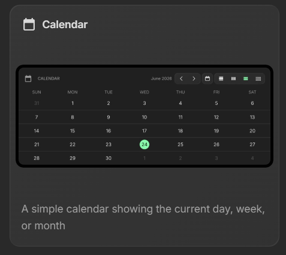

# Navigateur New Tab

`Navigateur New Tab` est une extension de nouvel onglet locale et minimaliste pour Chromium.

Au lieu d'ouvrir une page vide ou une extension générique, elle affiche un dashboard personnel orienté productivité avec dashboards internes, widgets déplaçables, listes de liens éditables et persistance locale.

## Pourquoi ce projet existe

Je ne trouvais pas de page de nouvel onglet qui corresponde vraiment à ma façon de travailler.

Les alternatives que j'essayais étaient souvent :

- trop génériques
- trop dépendantes d'un service externe
- trop chargées visuellement
- pas assez flexibles pour organiser travail, université et loisirs

J'ai donc construit ma propre extension : locale, compacte, rapide à charger, et personnalisable sans backend.

## Aperçu




## Fonctionnalités

- override complet de la page `new tab`
- dashboards internes : `Travail`, `Universite`, `Loisirs`, `Tout`
- widgets déplaçables
- listes de liens éditables
- moteur de recherche sélectionnable
- persistance locale via `chrome.storage.local` avec fallback `localStorage`
- interface sombre, compacte, sans framework

Widgets actuellement inclus :

- `search`
- `link-list`
- `spacer`
- `todo`
- `quick-note`
- `qr-code`
- `markdown-editor`
- `text-diff`
- `calendar`
- `kanban`
- `daily-quiz`
- `image-compression`
- `uptime-monitor`
- `browser-session`

## Stack

- HTML
- CSS
- JavaScript vanilla
- Chrome Extension Manifest V3

## Installation

### Chrome / Brave / Edge / Arc

1. Télécharge ou clone ce dépôt.
2. Ouvre la page des extensions du navigateur :
   - Chrome : `chrome://extensions`
   - Edge : `edge://extensions`
   - Brave : `brave://extensions`
3. Active le mode développeur.
4. Clique sur `Load unpacked` / `Charger l'extension non empaquetée`.
5. Sélectionne le dossier [`custom-new-tab`](./custom-new-tab).

Une fois l'extension chargée, un nouvel onglet affichera le dashboard personnalisé.

## Structure du dépôt

```text
custom-new-tab/
  manifest.json
  newtab.html
  app.js
  styles.css
  assets/icon.png
references/
  *.png
AGENTS.md
MISSION_WIDGETS_DASHBOARD.md
```

## Données et confidentialité

- aucune base de données
- aucun backend
- aucune authentification
- aucune télémétrie
- tout est stocké localement dans le navigateur

## Notes pour le code

- la logique principale vit dans [`custom-new-tab/app.js`](./custom-new-tab/app.js)
- les listes de liens historiques restent compatibles via `sections`
- les widgets `link-list` référencent encore ces sections avec `config.sectionId`
- la migration de données reste importante pour ne pas casser les installations existantes

## Licence

Ce projet est distribué sous licence MIT. Voir [`LICENSE`](./LICENSE).
