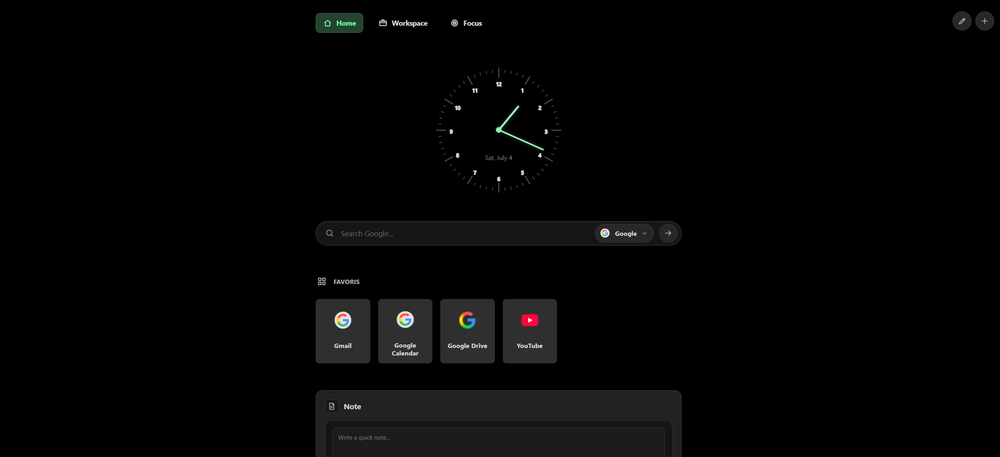

# Navigateur New Tab

`Navigateur New Tab` is a local-first, minimalist new tab extension for Chromium browsers.

Instead of opening a blank page or a generic start-page extension, it shows a personal dashboard built around quick access, lightweight widgets, editable link collections, and local persistence.

## Why I Built It

I never found a new tab page that matched how I actually work.

Most alternatives felt:

- too generic
- too dependent on external services
- too visually noisy
- not flexible enough to separate work, university, and leisure

So I built my own: fast, compact, customizable, and fully client-side.

## Browser Compatibility

This extension is designed for Chromium-based browsers because it relies on the Chrome Extension API and a `chrome_url_overrides` new tab integration.

That means it should work in browsers such as:

- Chrome
- Brave
- Edge
- other Chromium-based browsers with support for unpacked Chrome extensions

It is not intended for Safari, and it is not currently presented as fully supported on Firefox.

## Preview



## Features

- overrides the browser `new tab` page
- built-in dashboards: `Travail`, `Universite`, `Loisirs`, `Tout`
- draggable widgets
- editable link lists
- selectable search engine
- local persistence through `chrome.storage.local` with `localStorage` fallback
- dark, compact, framework-free UI

Current widget types:

- `search`
- `link-list`
- `spacer`
- `todo`
- `quick-note`
- `qr-code`
- `markdown-editor`
- `text-diff`
- `calendar`
- `kanban`
- `daily-quiz`
- `image-compression`
- `uptime-monitor`
- `browser-session`

## Tech Stack

- HTML
- CSS
- Vanilla JavaScript
- Chrome Extension Manifest V3

## Installation

### Chrome / Brave / Edge / Arc

1. Clone or download this repository.
2. Open your browser extensions page:
   - Chrome: `chrome://extensions`
   - Edge: `edge://extensions`
   - Brave: `brave://extensions`
3. Enable Developer Mode.
4. Click `Load unpacked`.
5. Select the [`custom-new-tab`](./custom-new-tab) folder.

Once loaded, opening a new tab will display the custom dashboard.

## Repository Structure

```text
custom-new-tab/
  manifest.json
  newtab.html
  app.js
  styles.css
  assets/icon.png
references/
  exemple_visuel.png
AGENTS.md
```

## Privacy

- no database
- no backend
- no authentication
- no telemetry
- everything is stored locally in the browser

## Implementation Notes

- most of the application logic lives in [`custom-new-tab/app.js`](./custom-new-tab/app.js)
- legacy link data still remains compatible through `sections`
- `link-list` widgets still reference those sections via `config.sectionId`
- migration safety matters to avoid breaking existing installs

## License

This project is released under the MIT License. See [`LICENSE`](./LICENSE).
